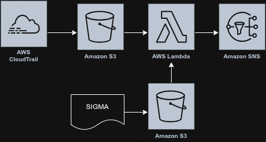

# about

Detection and alert that uses cloudtrail, run in native aws using lambda.

Lambda send sns if there is a match for certain cloudtrail API call.

The goal is to detect CloudTrail API calls that are both high-impact and indicative of malicious activity by having a lambda that load from sigma signature. 

# workflow

# deploy
you can deploy using the provided terraform or by uploading the zipped lambda directory
## using IAC
- prereq:
    - aws CLI is setup with the credentials
    - copy lambda directory to deploy/terraform/lambda -> this will be zipped and uploaded by the terraform
- terraform init
- terraform plan -> please recheck 
- terraform apply

## uploading zip
- zip the lambda directory
- upload zip package
- set up variables:
    - correct role and permission
    - snsarn
    - bucket name for cloudtrail
    - bucket name for sigma

# todo list 

- ~~create IAC to deploy~~
- format email alert
- create sigma examples